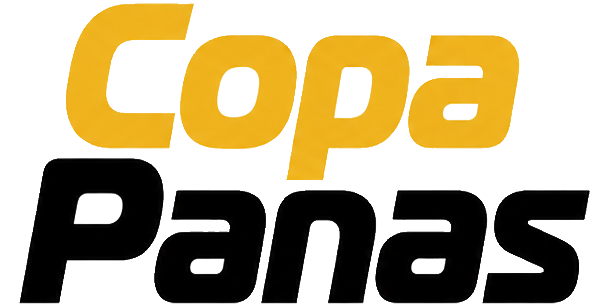
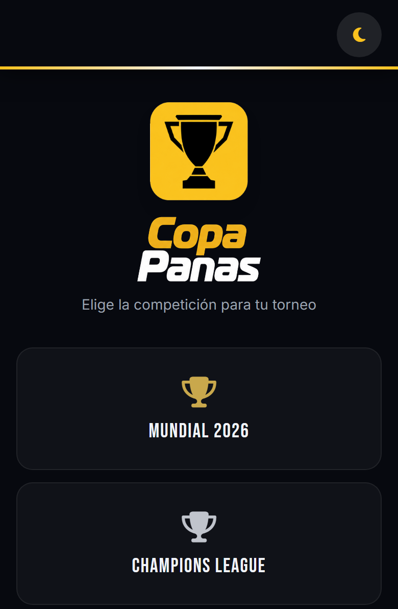
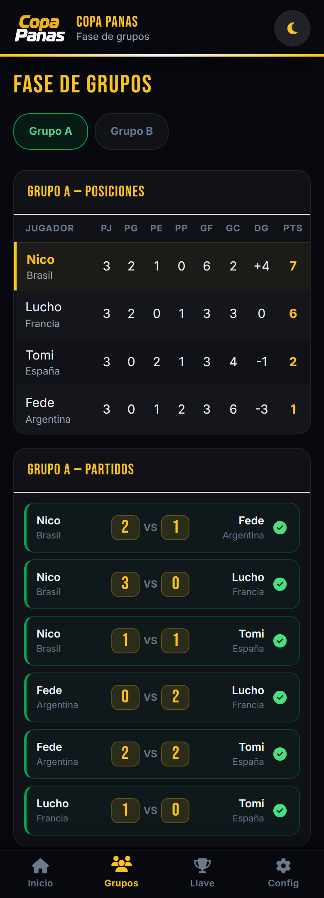
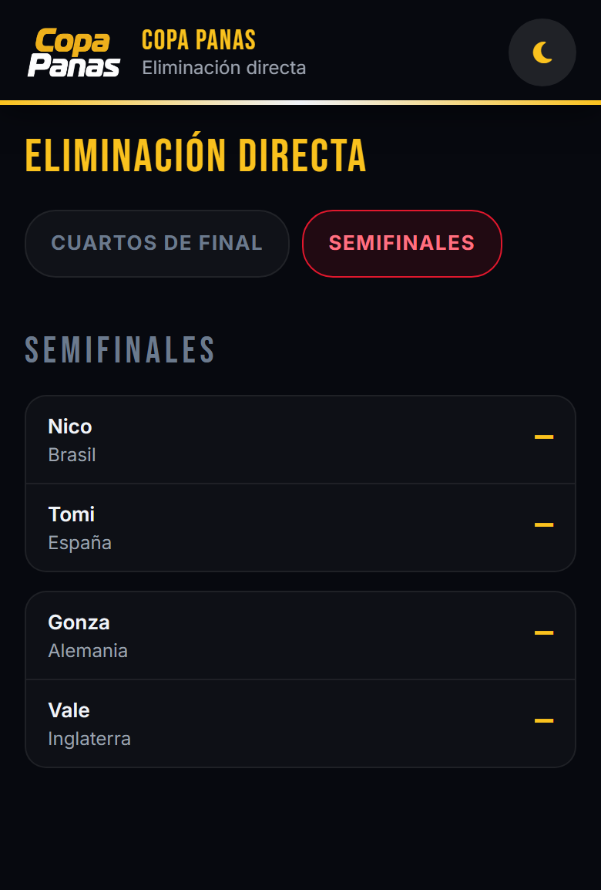
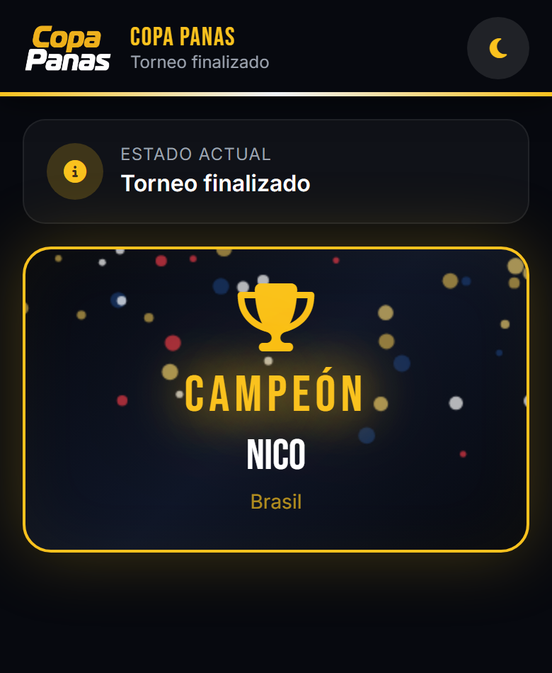
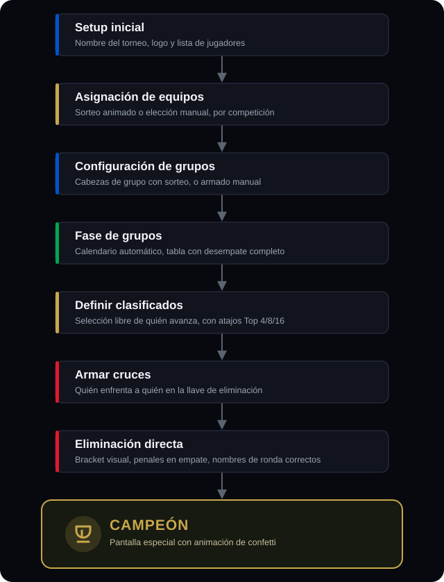

<div align="center">

<picture>
  <source media="(prefers-color-scheme: dark)" srcset="./assets/branding/wordmark-dark.png">
  <source media="(prefers-color-scheme: light)" srcset="./assets/branding/wordmark-light.png">
  
</picture>

**Torneos de fútbol entre amigos, de principio a fin, sin backend.**
Multi-competición (Mundial 2026 + Champions League), instalable como app y con
uso completo sin conexión una vez cargada.


[Ver demo en vivo](https://eduaardok.github.io/mundialito-web/) &nbsp;·&nbsp;
[Reportar un bug](https://github.com/eduaardok/mundialito-web/issues)

</div>

---

## Qué es Copa Panas

Nació como **Torneo Amigos FC 26**, una app fija para el Mundial 2026. Hoy es
**Copa Panas**: multi-competición desde el arranque — elegís **Mundial 2026**
o **Champions League** en una pantalla inicial — con el mismo motor de torneo
por debajo, desacoplado de tema y formato.

Gestiona el ciclo completo de un torneo amateur, desde el celular del
organizador, en cancha, sin conexión a un servidor propio:

- **Selección de competición** — Mundial 2026 o Champions League, cada una con
  su propio pool de equipos, paleta y formato sugerido
- **Setup** — nombre del torneo, logo personalizado, registro de jugadores con
  validación en tiempo real (duplicados marcados al instante)
- **Sorteo de equipos** — animación de bombo que revela el equipo/club de cada
  jugador, o asignación manual
- **Fase de grupos** — calendario round-robin (partido único o ida/vuelta),
  tabla de posiciones con desempate completo (pts → DG → GF → resultado
  directo)
- **Clasificados** — selección personalizada con checkboxes y atajos (Top 4,
  Top 8, Top 16)
- **Eliminación directa** — bracket visual por rondas con nombres correctos
  en todo momento, penales en caso de empate, avance automático de ganadores
- **Campeón** — pantalla especial con animación de confetti
- **Dashboard** — vista general del torneo desde cualquier punto
- **Exportar / Importar JSON** — comparte el estado del torneo o hacé un backup
- **Funciona sin conexión** — instalá la app y seguí registrando resultados
  aunque se corte la señal en la cancha

<div align="center">

&nbsp;&nbsp;

&nbsp;&nbsp;

&nbsp;&nbsp;

</div>

---

## Stack

| Tecnología | Uso |
|---|---|
| HTML5 | Estructura |
| CSS3 + Tailwind CDN | Estilos y layout, mobile-first y adaptado a desktop |
| JavaScript ES6+ | Toda la lógica, sin build ni bundlers |
| Font Awesome CDN | Iconografía — cero emojis en toda la interfaz |
| Google Fonts (Bebas Neue + Inter) | Tipografía |
| localStorage | Persistencia de datos del torneo |
| Service Worker | Precache de la app y uso offline real tras la primera carga |

Sin Node.js en runtime, sin npm, sin bundlers. Abre `index.html` directo o
sirve el repo como archivos estáticos.

---

## Cómo usar

### Opción A — Abrir directo

```bash
git clone https://github.com/eduaardok/mundialito-web.git
cd mundialito-web
# Abre index.html en tu navegador
```

### Opción B — GitHub Pages

```
https://eduaardok.github.io/mundialito-web/
```

Funciona igual desde el celular — Chrome para Android y Safari para iOS 15+ —
y en navegadores de escritorio modernos. Cargala una vez con conexión: desde
ahí podés instalarla como app y seguir usándola sin internet.

---

## Flujo del torneo

<div align="center">

</div>

---

## Compartir el torneo

Como no hay servidor, para que otros vean el torneo en tiempo real:

1. Ve a **Config → Exportar JSON**
2. Manda el archivo por WhatsApp
3. La otra persona abre la app, toca **Cargar torneo desde JSON** en la
   pantalla de inicio
4. Ve el torneo completo con todos los resultados

---

## Paleta de colores

**Mundial 2026** — inspirada en la sede (USA · Canadá · México):

| Color | Hex | Uso |
|---|---|---|
| Negro | `#07090f` | Fondo principal (global, no por competición) |
| Rojo | `#e0182d` | Eliminación directa, acciones importantes |
| Azul | `#0052c8` | CTAs, setup, configuración |
| Verde | `#00a64e` | Fase de grupos, éxito |
| Dorado | `#c9a84c` | Campeón, trofeo, líder de grupo |

**Champions League** — negro / plata / azul UEFA, sobre el mismo fondo global:

| Color | Hex | Uso |
|---|---|---|
| Plata | `#c0c4cc` | Acento de marca y "dorado" de campeón/líder |
| Azul UEFA | `#0e1e5b` | CTAs, setup, configuración |

Cada competición aporta su propio pool de equipos, textos y formato sugerido
— el motor de torneo (calendario, posiciones, bracket) no conoce ninguno de
estos valores.

---

## Arquitectura

```
mundialito-web/
├── index.html          — estructura HTML, CDN links, registro del service worker
├── styles.css           — estilos custom, animaciones, tema oscuro/claro
├── motor.js              — motor de torneo puro: calendario, posiciones, bracket
├── competiciones.js      — configuración por competición (pools, paletas, textos)
├── app.js                — orquestación de UI, estado y persistencia
├── sw.js                 — service worker: precache y uso offline
├── manifest.json         — metadata PWA (instalable, íconos, tema)
└── assets/branding/      — favicons, íconos PWA y wordmark
```

`motor.js` no importa ni referencia nada de una competición específica —
ninguna función del motor sabe si está corriendo un Mundial o una Champions.
Todo lo que varía por competición vive en `competiciones.js`, como
configuración pura.

---

## Cómo se construye

Copa Panas se desarrolla con **GitHub Spec Kit**: cada funcionalidad nueva
nace como un spec en [`specs/`](./specs) (objetivo, requisitos, plan técnico,
tareas) antes de escribirse una línea de código, y se valida contra
[`.specify/memory/constitution.md`](./.specify/memory/constitution.md) — las
reglas de arquitectura no negociables del proyecto (motor desacoplado del
tema, sin backend, un torneo activo a la vez, entre otras).

---

<div align="center">
Hecho con JavaScript puro para que funcione en cualquier celular, con o sin señal.
</div>
